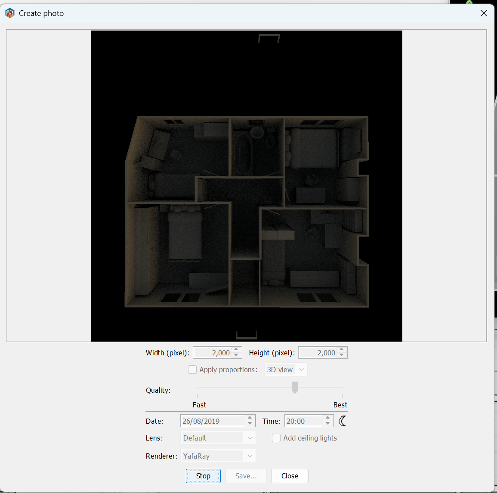
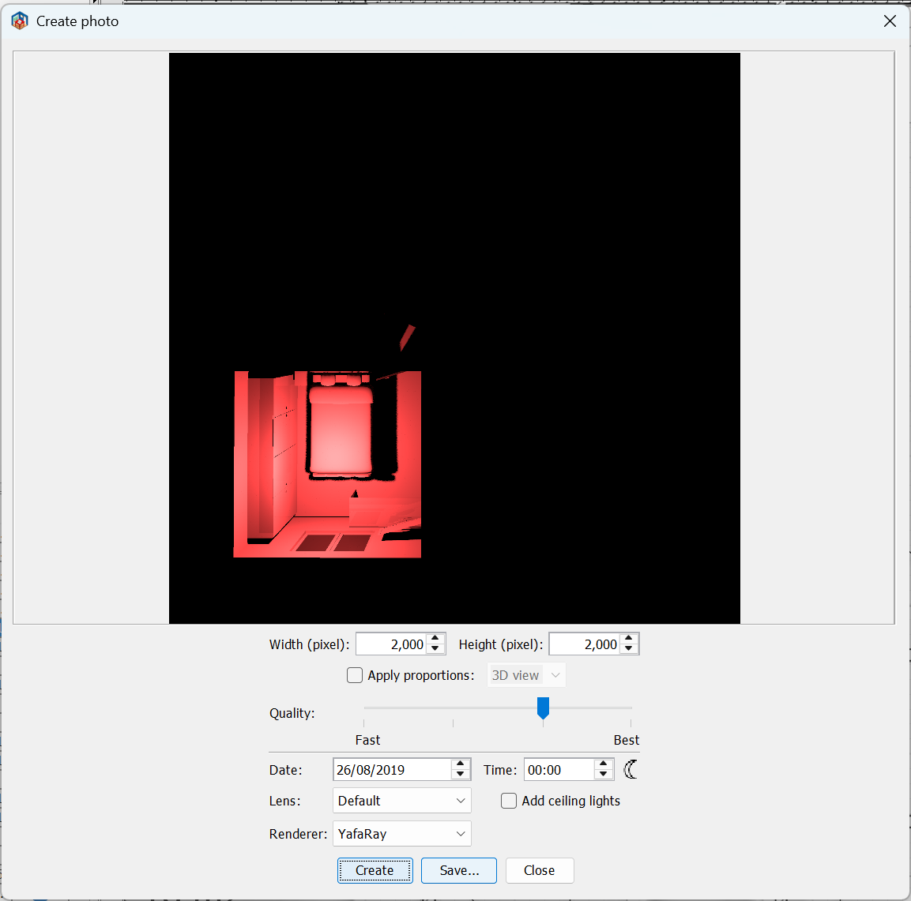
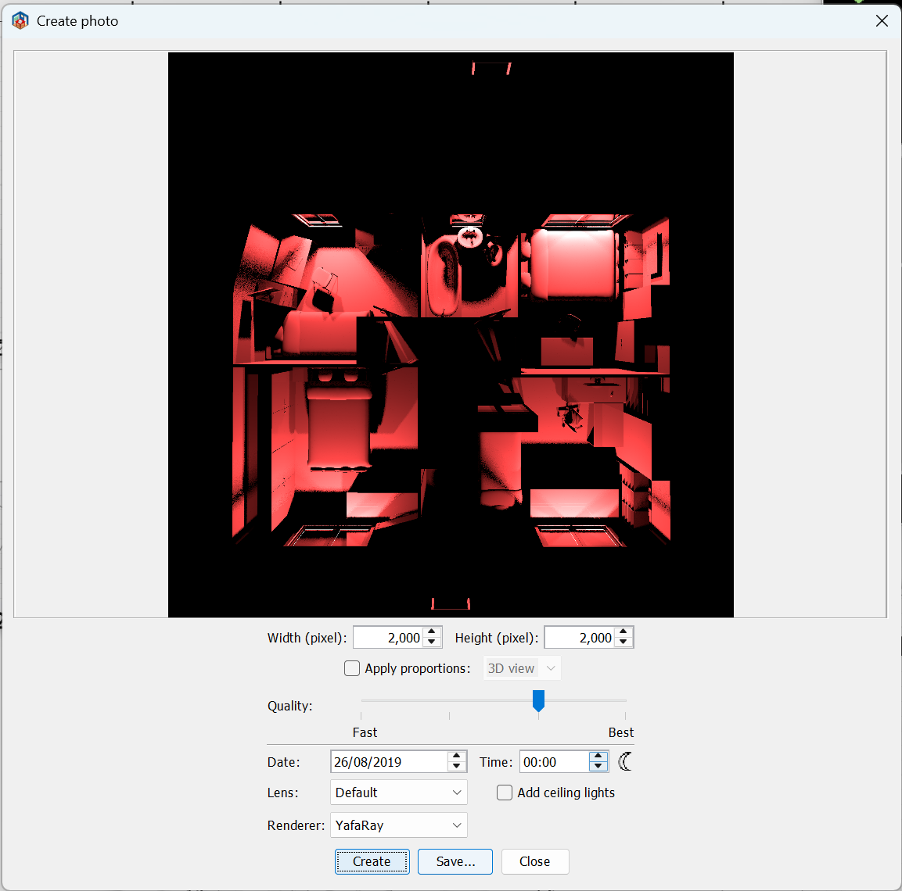
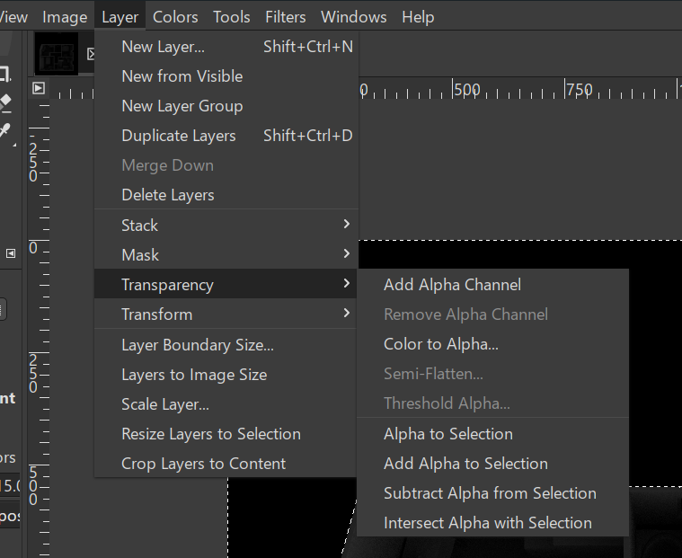
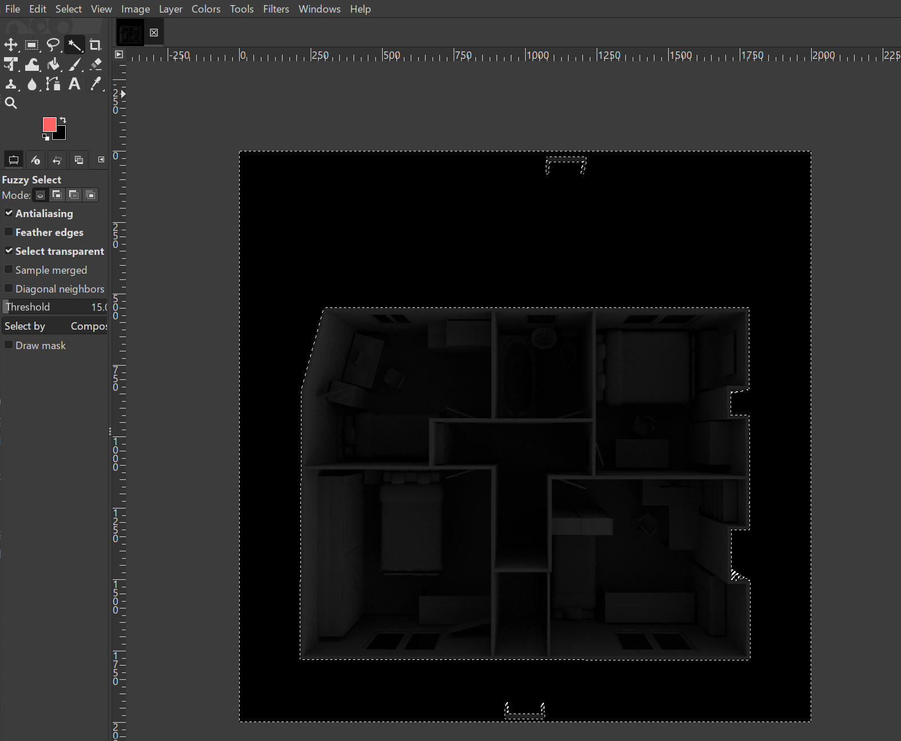
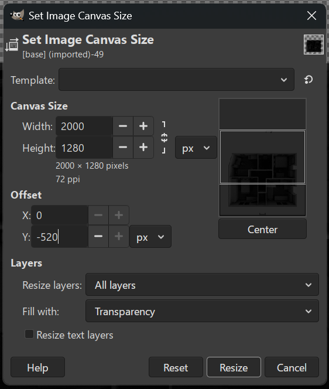

# Home Assistant Dashboard Working Copy

This repository keeps a working copy of the Home Assistant dashboard configuration.

Tracked content includes dashboard YAML, shared dashboard snippets, floorplans, images, and the configuration files needed to use them.

Intentionally excluded content includes Home Assistant runtime state, local secrets, databases, backups, and installed custom integrations. A fresh checkout is therefore a source copy of the dashboard, not a complete Home Assistant restore.

## 3D view

Upstairs and downstairs use the following Sweet Home 3D files:

- `bw upstairs.sh3d`
- `bw downstairs.sh3d`

### Rendering

Use the `above` points of view.

#### Base image

To render the base image, all lights must be disabled and the time set to `20:00`.

Save this as `base.png`.

#### Light images

To render the light images, enable the light you want to render an overlay for. Make sure the time is set to `00:00` so all the light is rendered.

Make sure when the images are saved, they match the entity names in Home Assistant, i.e. `light.bathroom.png`.

#### Daylight image

To render the daylight image, enable all the lights named `Daylight`. As with the light images, set the time to `00:00` so only the light output is rendered.

### Processing

To get the images ready for use in Home Assistant, some additional post-processing is required.

#### Base images

Using GIMP:

- Convert to grayscale.
- Use "Brightness & Contrast" and set the brightness to `-127`.
- Use "Brightness & Contrast" and set the brightness to `-60`.
- Use "Add Alpha Channel". 
- Use the fuzzy select and select the black background around the image. 
- Delete the selected area, this will make the background transparent.

#### Upstairs images

This needs the "Batcher" plugin for GIMP, https://kamilburda.github.io/batcher/. Once installed, use GIMP:

- Use "Open as layers" to open all the overlay images, daylight and all light images.
- Now select "Canvas Size..." use the following settings: 
- Providing you've installed the plugin, select "Export Layers" to export the resized images.
